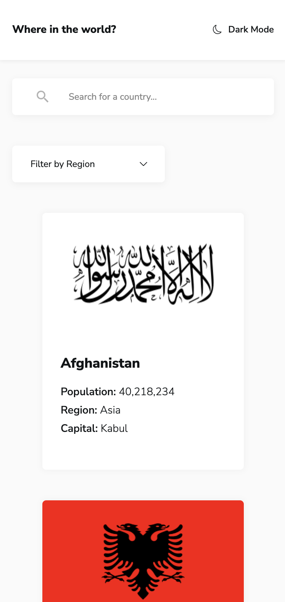
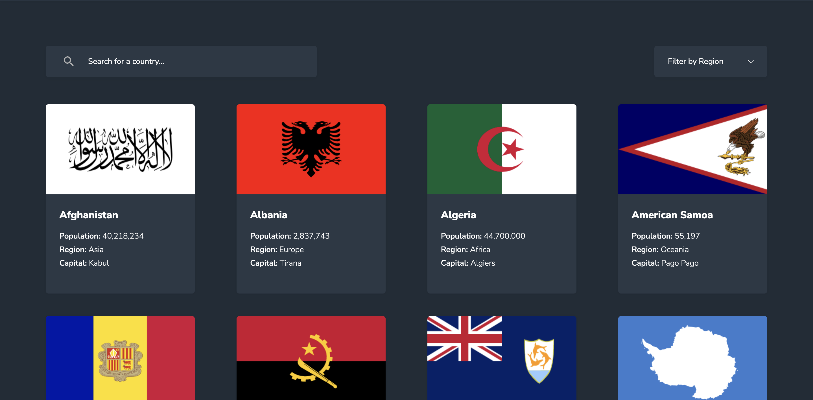

# Frontend Mentor - REST Countries API with color theme switcher solution

This is a solution to the [REST Countries API with color theme switcher challenge on Frontend Mentor](https://www.frontendmentor.io/challenges/rest-countries-api-with-color-theme-switcher-5cacc469fec04111f7b848ca). Frontend Mentor challenges help you improve your coding skills by building realistic projects.

## Table of contents

- [Overview](#overview)
  - [The challenge](#the-challenge)
  - [Screenshot](#screenshot)
  - [Links](#links)
- [My process](#my-process)
  - [Built with](#built-with)
  - [What I learned](#what-i-learned)
  - [Useful resources](#useful-resources)
- [Author](#author)

## Overview

### The challenge

Users should be able to:

- See all countries from the API on the homepage
- Search for a country using an `input` field
- Filter countries by region
- Click on a country to see more detailed information on a separate page
- Click through to the border countries on the detail page
- Toggle the color scheme between light and dark mode _(optional)_

### Screenshot

### Links

- Solution URL: [Add solution URL here](https://your-solution-url.com)
- Live Site URL: [https://incomparable-clafoutis-ccc8d4.netlify.app/]

## My process

### Built with

- Semantic HTML5 markup
- CSS custom properties
- Flexbox
- Mobile-first workflow
- [React](https://reactjs.org/) - JS library

### What I learned

In this project I learned more about React hooks, more specifically, the useContext, useEffect and useState hooks.
I used useContext to set the loading state, rendering a Loading Spinner component while fetching data from the REST countries API. I used useState to store countries data and things like theme mode, search results and whether the dropdown menu was open or closed.

### Useful resources

- [https://react.dev/] - The React docs are a must have resource when working on React projects.
- [https://www.makeuseof.com/how-to-add-dark-mode-to-a-react-application/] - I used this site to configure the theme mode switcher, allowing a user to choose between light and dark mode.

## Author

- Website - [Add your name here](https://www.your-site.com)
- Frontend Mentor - [@jake4369](https://www.frontendmentor.io/profile/jake4369)
- Twitter - [@jakexcode](https://www.twitter.com/jakexcode)
